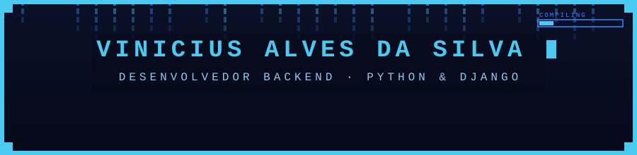

[README.md](https://github.com/user-attachments/files/31521338/README.md)

 

  

 

## 👋 Sobre mim

Sou desenvolvedor backend com Python e Django desde 2022, passando por projetos próprios, freelas e atualmente atuando no desenvolvimento de um SaaS utilizado diariamente pela empresa onde trabalho (SGA). Curso Sistemas de Informação na UNIP e gosto de resolver problema de verdade — da modelagem até o deploy em produção.

<ul>
  <li>🔭 Atualmente desenvolvendo funcionalidades e mantendo um sistema SaaS em produção</li>
  <li>🌱 Aprendendo mais sobre TypeScript e boas práticas de arquitetura backend</li>
  <li>💼 Também atuo como freelancer, do levantamento de requisitos à entrega final</li>
  <li>🗣️ Inglês nível B1 (Intermediário)</li>
</ul>

 

## 🛠️ Stack

 

## 📌 Projeto em destaque

<table>
<tr>
<td>

**Landing Page — CTR Transportes**

Página institucional responsiva, publicada em produção, com foco em navegação rápida e boa experiência em diferentes dispositivos.

🔗 [ctr-transportes.com](https://ctr-transportes.com/)

</td>
</tr>
</table>

 

## 📊 Estatísticas

 

